# GraphicIDE

At the dawn of time, cavemen wrote their programs using TextUserInterface IDEs, which displayed their code in black and white (much like the rest of the world back then). 
As humanity evolved, we got GraphicUserInterface IDEs and more importantly, ***Syntax Highlighting***.
Not only do we get to pretend to be artists while programming, syntax highlighting also makes code a lot easier to understand at a glance, and in turn makes programming a lot easier.

So now I pose the question - What's next? Is syntax highlighting the best we'll ever get or can we continue to evolve?
No, I don't think Scratch is the answer. (I do however think it's a great tool for learning)

So I did the only logical step:

    black & white -> colors -> Pictures!

What if instead of making my text colorful it turned it into pictures?

Boring:

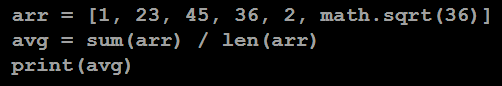

Normal:

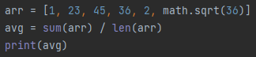

Better?:

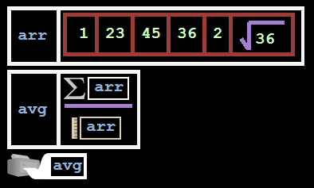


So I made a Python IDE which transforms your code into pictures for it to be easier to read at a glance (and some other features I feel are missing in other IDEs).

Why?

* It's a fun and interesting project
* I wanted to open this door and see where it might lead, maybe there is some in between sweet spot
* I think this might be good for making visualizations or maybe teaching?
* I like pictures more than colorful text
* I was bored...


I've decided to make this project mainly as a proof of concept and to see if it's actually plausible. So as of now, in my opinion, it's a bit over the top. Since it's a proof of concept, many of the things are not completely polished.

Please keep these things in mind while looking at the project.


# Examples

### Assignment
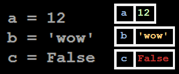

### Math
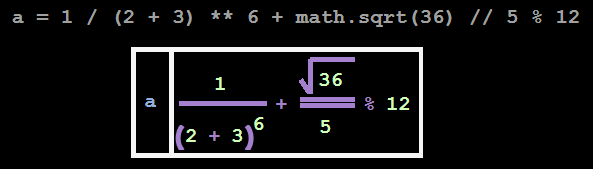

### If Elif Else
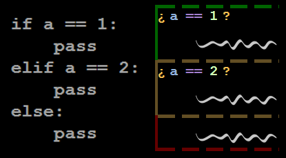

### While
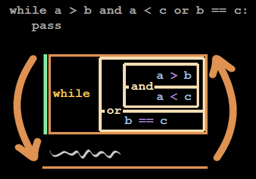

### For
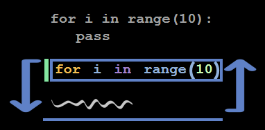

### Imports
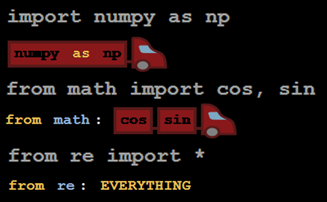

### Iterables
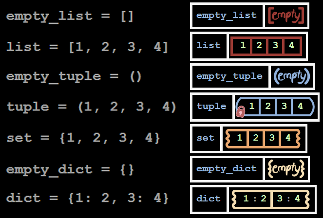

### Break Continue
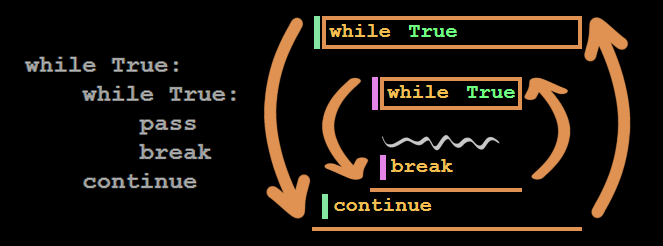

The color before the break\continue indicates which loop it corresponds to

### Short If Else
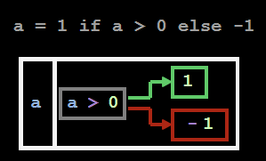

### Print, Return, None
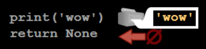

### Comprehension
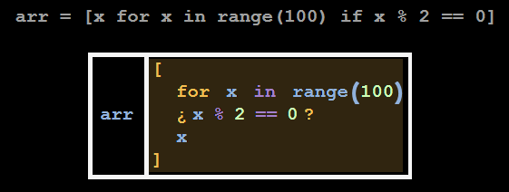

### Lambda
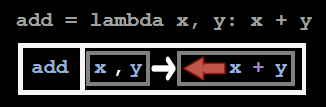

### Some Built-in Functions
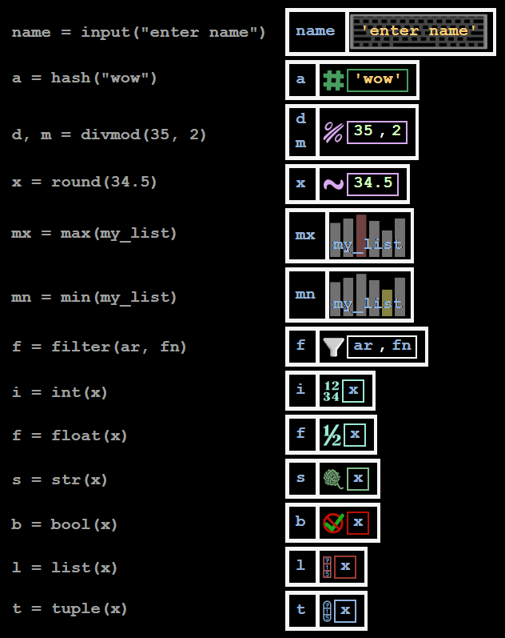


## Guessing game
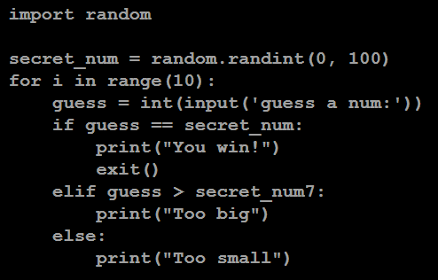
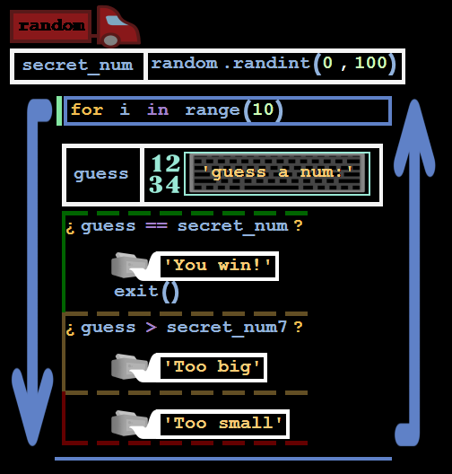


## Random (just to show the graphics)
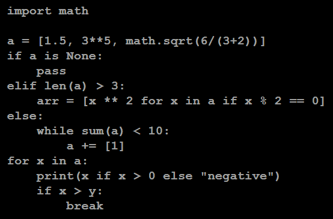
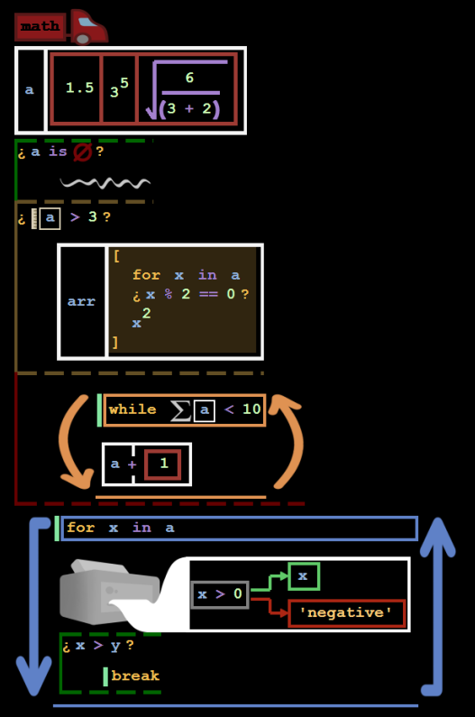


I found that having it turn your code into pictures as you're typing was confusing and annoying (also hard to program) so instead I opted for a simpler solution - Each function will go in it's own tab, the tab you're editing will be displayed normally but the other tabs will be displayed as pictures (you can also toggle the current tab between text and picture by pressing *insert*).


# The Rest of the IDE

Now that you've seen most of the graphics let's move on to the rest of the IDE.
I decided to not use the built in textbox but rather make my own from scratch. You might wonder - Why??
    
* At the start I was making it display the pictures as you typed, and since you can't have both text and pictures in a text box I needed to make my own.
    
* I was always interested in how textboxes work, so instead of researching it like a normal person I just made my own.


So I had to program everything - typing, moving the caret, cut/copy/paste, ctrl z/y, selecting with the mouse, scrolling, and much much more. Or in other words, don't be too surprised if something doesn't work properly...


## Exceptions
I know this probably has never happened to you but sometimes when you run your code, you are greeted with an exception, such as ```ZeroDivisionError: division by zero```

Now the obvious next step is to Google the exception, to make this *agonizing* task simpler I've made a button which will do just that for you.


## Basic functionalities
I've also added the basic features of any IDE, which you can access with the buttons at the top right:


open file [ctrl + O], save [ctrl + S], delete tab (and the function), rename function [ctrl + R], add function [ctrl + N], settings (right now only has lightmode), run [ctrl + Space or middleMouseButton] 


## Timer
There is a nice little timer at the bottom which will tell you how long your code took to execute. If this bothers you you can simply click on it to hide it.


## Right Click
If you right click you will find this little menu:

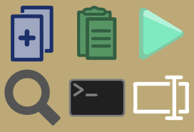

(from top left to right) Copy [Ctrl + C], Paste [Ctrl + V], Run, Search (will Google whatever you have selected), Cmd (opens the cmd), Rename (!DOESN'T WORK YET!)

To close it just click anywhere else


## Predictions
As you code you will be offered predictions (which as of now are pretty terrible).
To accept them press Tab.
To select a different one use up/down arrow keys.
To ignore just keep typing or use left/right arrow keys.


## Other Shortcuts
Duplicate [Ctrl + D]
Cut [Ctrl + X]
Select All [Ctrl + A]
Undo [Ctrl + Z]
Redo [Ctrl + Y]
Toggle Console [Ctrl + ~]
Make Font Bigger [Ctrl + +]
Make Font Smaller [Ctrl + -]
Comment out chunk [Ctrl + /]


# Usage
Download the latest release from the releases tab and run the exe.

Make sure you have Python installed on your computer.

The screen should be split into two, on the left is .Main this is the part of your program which will be run, on the right side there is func() this is an example function you can write. No need to write:
```python
def func():
```
or indent in the functions.
You can now write your program in .Main and for any function just make a new Tab and write it there.

The reason you aren't seeing pictures but rather just normal text is because the tab you are focused on shows text as to not be annoying to write. To get it to display pictures either click on a different tab (the one on the right) or press `insert`

Finally run the program, it might ask you to save it first.


# Missing Features (coming soon?)

In no particular order:

Make it work on linux\mac cuz as of now it only works on windows (I think)

Auto save

Scroll horizontal

Refactoring

Being able to stop execution

Debugger

Comments, and even letting you make little drawings in the comments

A file system 

Syntax Highlighting for the text

### missing python features

classes, annotations, decorators, generators, del, global, assert, yield\yeild from, with, try-catch-else-finally, raise, else clause on for-loop, f-strings, * operator, and probably other things I forgot about

And a bunch of builtin functions that don't have special pictures yet